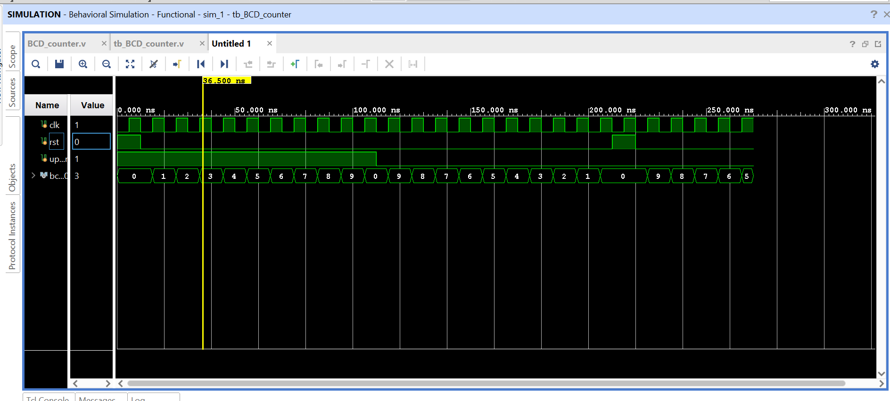

# BCD Up/Down Counter – Verilog (Xilinx Vivado)

## Project Description  
This project implements a **BCD (Binary Coded Decimal) Up/Down Counter** in **Verilog HDL** using **Xilinx Vivado**.  
The counter is capable of counting decimal digits from **0 to 9** in both directions:  
- **Up counting**: 0 → 1 → 2 → … → 9 → 0  
- **Down counting**: 9 → 8 → 7 → … → 0 → 9  

It includes:  
- **RTL design** in Verilog  
- **Testbench** for behavioral simulation  
- Waveform verification in Vivado  

## Features  
- Counts in **Binary Coded Decimal (BCD)** format (4-bit output)  
- **Up/Down control** using a single input (`up_down`)  
- **Synchronous counter** with **asynchronous reset**  
- Verified through **Vivado simulation**  
- Ready for FPGA implementation (LEDs or 7-segment display)
  
##  Inputs & Outputs  
### Inputs:  
- `clk` → Clock input  
- `reset` → Active-high reset (resets counter to 0)  
- `up_down` → Count direction (1 = up, 0 = down)  

### Output:  
- `bcd_out[3:0]` → 4-bit BCD counter output  

## Simulation Results  
The simulation confirms:  
- **Up counting** from 0 → 9 and rollover back to 0  
- **Down counting** from 9 → 0 and rollover back to 9  

  

## Tools & Environment  
- **HDL**: Verilog  
- **IDE**: Xilinx Vivado  
- **Target FPGA**: Basys 3, Nexys A7 or any Xilinx FPGA  

 
## Repository Structure  
bcd_updown_counter
┣ 📜 bcd_updown_counter.v # RTL design
┣ 📜 tb_bcd_updown_counter.v # Testbench
┣ 📜 README.md # Project documentation
┗ 📜 waveform.png # Simulation result
